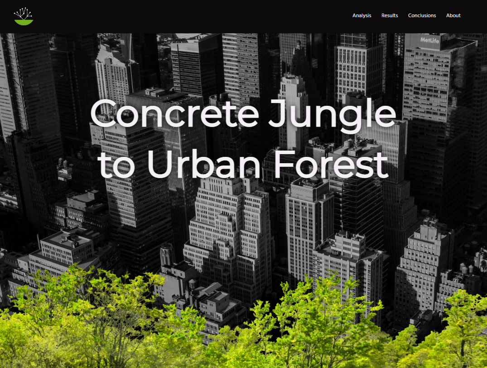

# Code Bridge: NYC Trees

### Overview

* Intro
* Preview
* GitHub Pages

**Intro**

A data-driven landing page created for Practicum's Fall 2022 Code Bridge.

 In an effort to grow a ‘greener’ New York City, the New York City Department of Parks and Recreation has attempted to turn its concrete jungle into ‘urban forests’ by planting trees throughout various boroughs of NYC.
 
  The data analyzed is sourced from reports from the New York City Tree Work Hub, which provided data about street tree planting in several different New York neighborhoods. With this data, we wanted to focus on creating a site that would provide the user with a simple and interesting way to retrieve the following information: 
  - the overall distribution of trees planted in each borough, 
  - the status of whether or not the scheduled planting was completed or still pending and 
  - provide a visualization of boroughs that are greener based on the number of trees in each borough. The user will be able to use the map to locate boroughs in NYC that are greener versus those that still need more work. 

---

**Preview**

**GitHub Pages**

* [Link to the project on GitHub Pages](https://who-code-the-world-girls.github.io/codebridge_nyctrees/)
